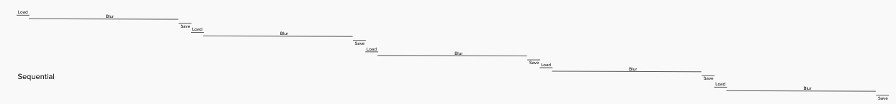
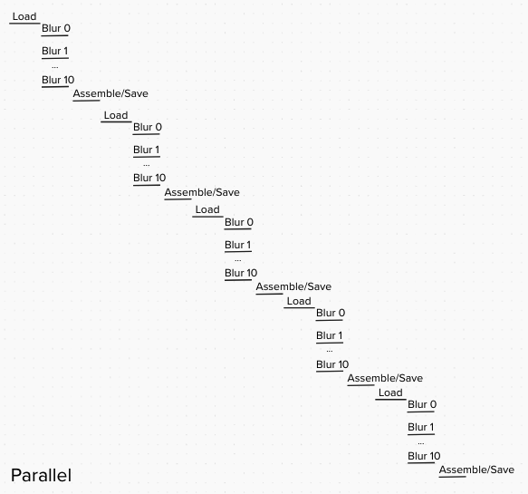
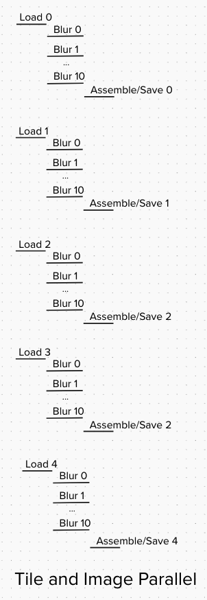

# studyguide.parallel
Implementing patterns from my C++ multi-threading course in Go

## Image Processing Approaches

### View the results of passed rus in `results/`

### To run
`go run .`

This project demonstrates three different approaches to processing images with Gaussian blur:

### 1. Sequential Processing (~13 second average)
- **File**: `a_sequential.go`
- **Approach**: Processes images one at a time in sequence
- **Implementation**: Single-threaded, applies Gaussian blur to each image sequentially
- **Performance**: Slowest approach, baseline for comparison

### 2. Parallel Tile Processing (~3.5 second average)
- **File**: `b_tile_parallel.go`
- **Approach**: Tile level parallelism
- **Implementation**: 
  - Divides each image into 256x256 tiles with padding for seamless blur
  - Uses 10 worker goroutines to process tiles concurrently
  - Processes images sequentially but uses parallelism within each image
- **Performance**: ~3x faster than sequential due to multi-threading

  Coordinator ──┐
                ├─→ tileQueue ──┬─→ Worker 1 ──┐
                │               ├─→ Worker 2 ──├─→ resultQueue ──→Assembler
                │               ├─→ Worker 3 ──┤
                │               └─→ ...     ──┘
                └─ (1 producer)    (10 consumers/producers)    (1 consumer)

### 3. Parallel Tile and Image Processing (~2 seconds)
- **File**: `c_tile+image_parallel.go`
- **Approach**: Tile level + image level parallelism
- **Implementation**:
  - Image loading, tile processing, and image assembly run concurrently
  - Multiple images can be in different pipeline stages simultaneously
  - Uses the same tile-based approach with 10 workers as parallel version
  - Optimizes overall throughput by overlapping I/O and computation
- **Performance**: Fastest approach, ~5x faster than sequential

                                          ┌─→ Image 1
  PipelineReader ──┬─→ imageDataChannel ──┼─→ Image 2
  (Parallel Load)  │  (all images)        └─→ Image 3...
                   └─ (multiple producers)

                      ↓

  PipelineCoordinator ──┐
  (All images)          ├─→ tileQueue ──┬─→ Worker 1 ──┐
                        │               ├─→ Worker 2 ──├─→ resultQueue ──→ AssemblerManager
                        │               ├─→ Worker 3 ──┤                        │
                        │               └─→ ...     ──┘                         │
                 So if  └─ (1 producer)    (10 consumers/producers)             │
                                                                                │
                                                              ┌─────────────────┘
                                                              │
                                            ┌─→ Assembler 1 (Image 1) ──→ [Output 1]
                                            ├─→ Assembler 2 (Image 2) ──→ [Output 2]
                                            └─→ Assembler 3 (Image 3) ──→ [Output 3]
                                                (parallel assemblers)

  Key Differences from b_tile_parallel.go:

  1. Parallel Image Loading - Multiple images loaded concurrently (Performance Opportunity: We don't kick off processing until all images are loaded. Doing so would save more time.)
  2. Image-aware Tiles - Each tile carries ImageID for routing so that workers can process any tile that is in the Queue regardless of what Image it is from.
  3. Assembler Manager - Routes tiles to correct assembler based on ImageID
  4. Multiple Assemblers - One per image, running in parallel, assemblers are created ahead of time and wait until AssemblerManager routes a processed tile from the resultQueue to them. Assembler processes image until their channels are closed.
  5. True Pipeline - All stages can run concurrently:
    - Loading image 2 while processing tiles from image 1
    - Assembling image 1 while blurring tiles from image 2

Concurrent or Parallel?
  - In C++ threads will run in parallel until the computer's cores all become busy, at which point the processing will happen concurrently. Go routines are not operating system threads, they are managed by the go runtime so I would need to do some studying and testing to understand the optimal number of routines and number of tiles to divide images into. Either way, the performance gains show that we are finding some parallelism in this implementation.
